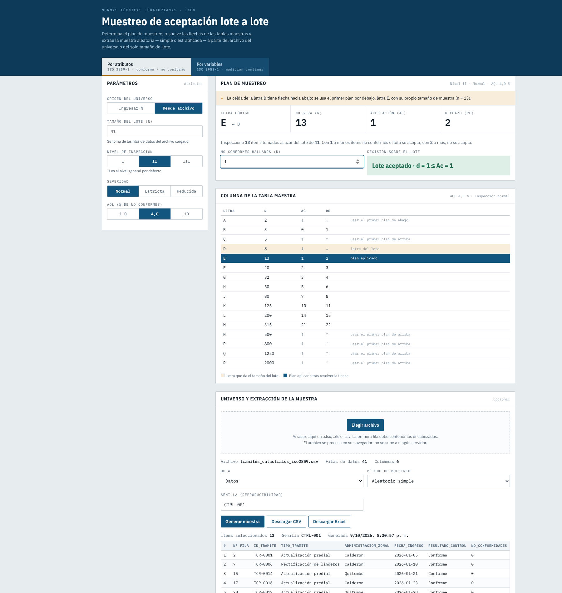
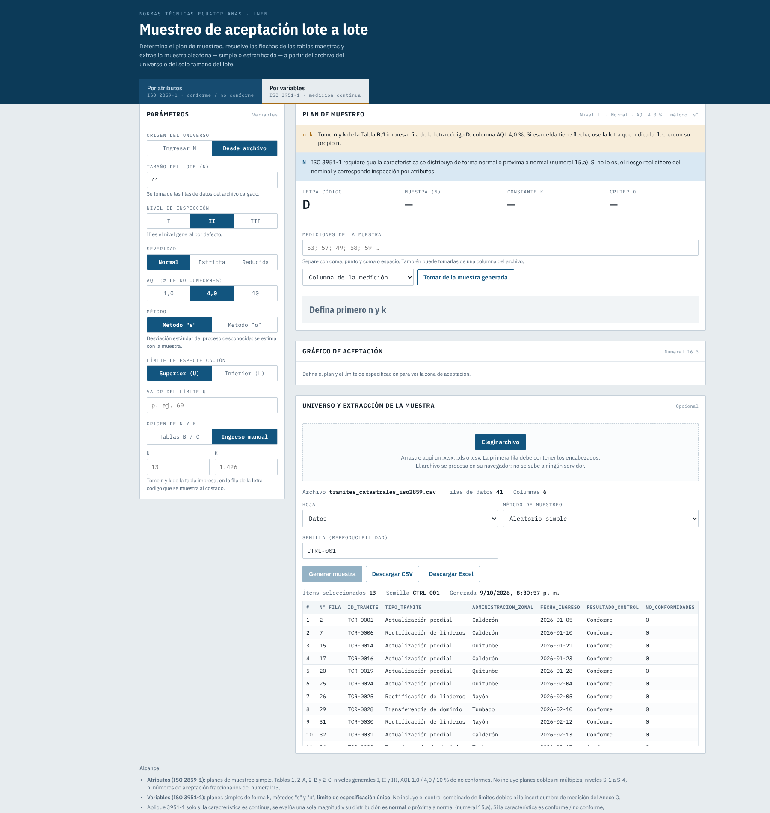

<div align="center">

# Muestreo de aceptación · ISO 2859-1 e ISO 3951-1

**Calculadora web de planes de muestreo de aceptación y extractor de muestras reproducibles para controles de calidad de datos, expedientes y mediciones.**

[](https://faustoaguanor.github.io/acceptance-sampling/)
[](LICENSE)


### 🔗 [**Abrir la demo en línea →**](https://faustoaguanor.github.io/acceptance-sampling/)



</div>

---

## Tabla de contenidos

- [Por qué existe](#por-qué-existe)
- [Capturas de pantalla](#capturas-de-pantalla)
- [Características](#características)
- [Inicio rápido](#inicio-rápido)
- [Verificación y exactitud](#verificación-y-exactitud)
- [Ejemplos reproducibles](#ejemplos-reproducibles)
- [Límites de uso](#límites-de-uso)
- [Privacidad y reproducibilidad](#privacidad-y-reproducibilidad)
- [Estructura del repositorio](#estructura-del-repositorio)
- [Despliegue](#despliegue)
- [Licencia y atribuciones](#licencia-y-atribuciones)

## Por qué existe

Aplicar una tabla de muestreo a mano es propenso a errores, sobre todo cuando
la celda de la letra de código tiene una **flecha** que obliga a saltar a otro
plan. Esta herramienta resuelve el plan, **muestra la letra original y la
aplicada** para que el salto quede documentado, y extrae la muestra aleatoria
con una semilla registrada, de modo que el control sea **auditable y repetible**.

## Capturas de pantalla

| Plan por atributos (ISO 2859-1) | Plan por variables (ISO 3951-1) |
|:--:|:--:|
|  |  |

> Caso mostrado: lote de 41 trámites, inspección normal, nivel general II,
> AQL 4,0 %. La letra `D` lleva flecha hacia abajo, se aplica la letra `E`
> (`n = 13`, `Ac = 1`, `Re = 2`) y con `d = 1` el lote se acepta.

## Características

| Módulo | Detalle |
|---|---|
| **Atributos · NTE INEN-ISO 2859-1** | Planes simples, Tablas 1, 2-A, 2-B y 2-C; niveles generales I, II y III; inspección normal, estricta y reducida; AQL 1,0 %, 4,0 % y 10 % |
| **Resolución de flechas** | Muestra la letra original, la letra aplicada, `n`, `Ac` y `Re` |
| **Variables · ISO 3951-1** | Planes simples de forma `k`, un límite de especificación (`U` o `L`), métodos `s` y `σ`, con gráfico de aceptación |
| **Extracción de muestra** | Aleatoria simple o estratificada proporcional, con opción de al menos un elemento por estrato |
| **Reproducibilidad** | Semilla configurable; el resultado se puede regenerar idéntico |
| **Entrada / salida** | Lee CSV y XLSX; descarga CSV o XLSX con hojas `Muestra`, `Registro` y `Estratos` |
| **Autoverificación** | El motor ejecuta 9 comprobaciones contra casos conocidos de las normas al cargar |
| **Privacidad** | 100 % en el navegador, sin servidor ni telemetría |

## Inicio rápido

**Opción 1 — En línea:** abra la [demo](https://faustoaguanor.github.io/acceptance-sampling/).

**Opción 2 — Local:** no requiere instalación ni compilación.

```bash
git clone https://github.com/faustoaguanor/acceptance-sampling.git
cd acceptance-sampling
# abra index.html en el navegador, o sirva la carpeta:
python3 -m http.server 8000   # http://localhost:8000
```

**Flujo de uso**

1. Elija **Por atributos** o **Por variables** y defina lote, nivel, severidad y AQL.
2. Cargue un CSV/XLSX con el encabezado en la primera fila (o ingrese solo `N`).
3. Seleccione muestreo simple o estratificado y, en este caso, la columna del estrato.
4. Pulse **Generar muestra**.
5. Registre los no conformes hallados (`d`) o las mediciones y obtenga el dictamen.
6. Descargue el respaldo CSV/XLSX.

La librería de Excel está incluida en `libs/xlsx.full.min.js`: la lectura y
descarga de XLSX no depende de una CDN.

## Verificación y exactitud

Al cargar, la aplicación autoverifica su motor (sección inferior de la
página). Algunos de los casos comprobados:

- ISO 2859-1 · `N = 41`, II, normal, AQL 4,0 % → `D↓E`, `n = 13`, `Ac 1 / Re 2`
- ISO 2859-1 · `N = 1200`, II, normal, AQL 4,0 % → letra `J`, `n = 80`, `Ac 7 / Re 8`
- Flechas ↓ y ↑, inspección estricta y reducida
- ISO 3951-1 · ejemplos 16.2 (límite superior e inferior) y 17.2 (método `σ`)

## Ejemplos reproducibles

### Comprobación de la flecha: N = 41, AQL = 4,0 %

Con inspección normal y nivel general II, el tamaño de lote `N = 41` produce
la letra de código `D`. En la Tabla 2-A, la flecha de la columna AQL 4,0 %
indica usar el primer plan por debajo: letra `E`, `n = 13`, `Ac = 1` y
`Re = 2`. La aplicación muestra ambos valores para que el salto no quede
oculto.

### Ejemplo 1: trámites catastrales

Archivos: [`examples/tramites-catastrales/`](examples/tramites-catastrales/).

`tramites_catastrales_iso2859.csv` contiene 41 registros sintéticos. Para
reproducir el caso anterior:

- seleccione **Por atributos**, inspección **normal**, nivel general **II** y
  AQL **4,0 %**;
- cargue el CSV y use muestreo simple para obtener `n = 13`;
- para probar estratificación, seleccione `ADMINISTRACION_ZONAL` como columna
  del estrato y use asignación proporcional;
- cuente los trámites no conformes de la muestra y registre ese valor en el
  control `d` para emitir el dictamen.

La carpeta contiene instrucciones y datos sin información personal.

### Ejemplo 2: puntos GNSS de Quito

Archivos: [`examples/gnss-quito/`](examples/gnss-quito/).

Se incluyen dos universos sintéticos separados porque el límite de aceptación
es distinto por ámbito:

- `puntos_gnss_quito_urbanos.csv`: tolerancia `0,33 m`.
- `puntos_gnss_quito_rurales.csv`: tolerancia `2,00 m`.

La columna `ERROR_POSICIONAL_M` representa el error horizontal ya calculado:

`sqrt((ESTE_GNSS - ESTE_REF)^2 + (NORTE_GNSS - NORTE_REF)^2)`

Para evaluar una muestra por variables, seleccione esa columna, límite
superior `U` y escriba `0,33` o `2,00` según el archivo. Las tablas B/C de
ISO 3951-1 no están transcritas en esta versión: `n` y `k` deben tomarse de
la tabla oficial aplicable y registrarse en la interfaz. Para un control por
atributos, use la columna `CUMPLE` y un plan de ISO 2859-1.

La tolerancia indicada es un supuesto de trabajo del ejemplo; la tolerancia
oficial debe provenir del procedimiento técnico y de la autoridad competente.

## Límites de uso

La aplicación no implementa planes dobles o múltiples, niveles especiales
S-1 a S-4, límites dobles de variables ni incertidumbre de medición. En
variables, el supuesto de normalidad o aproximación a la normalidad, la
independencia, la aleatoriedad y la trazabilidad de las mediciones deben ser
revisados por el responsable técnico.

El resultado es una ayuda de cálculo y no reemplaza la norma vigente, el plan
de calidad, el procedimiento institucional ni el juicio profesional.

## Privacidad y reproducibilidad

Los archivos se procesan en el navegador y no se envían a un servidor de esta
aplicación. No publique datos reales de ciudadanos, expedientes o coordenadas
en un repositorio público. Conserve el XLSX descargado: contiene el registro
del plan, la semilla usada y, en el caso estratificado, la asignación por
estrato.

## Estructura del repositorio

```text
.
├── index.html            # aplicación completa (HTML + CSS + JS)
├── libs/                 # SheetJS (lectura/escritura XLSX) y su licencia
├── examples/             # datos sintéticos y guías de uso
│   ├── tramites-catastrales/
│   └── gnss-quito/
├── docs/img/             # capturas de pantalla
├── publish.ps1           # script de publicación para Windows
├── ATTRIBUTIONS.md
└── LICENSE
```

## Despliegue

La aplicación es estática y se publica con **GitHub Pages**:
*Settings → Pages → Source: Deploy from a branch → `main` / `(root)`*. La URL
resultante es `https://faustoaguanor.github.io/acceptance-sampling/`.

En Windows también puede usar `publish.ps1` (requiere Git y GitHub CLI):

```powershell
gh auth status
.\publish.ps1
```

## Licencia y atribuciones

El proyecto se distribuye bajo [MIT](LICENSE). Las dependencias y avisos de
terceros están documentados en [ATTRIBUTIONS.md](ATTRIBUTIONS.md).
